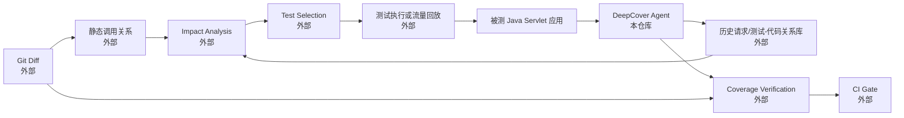
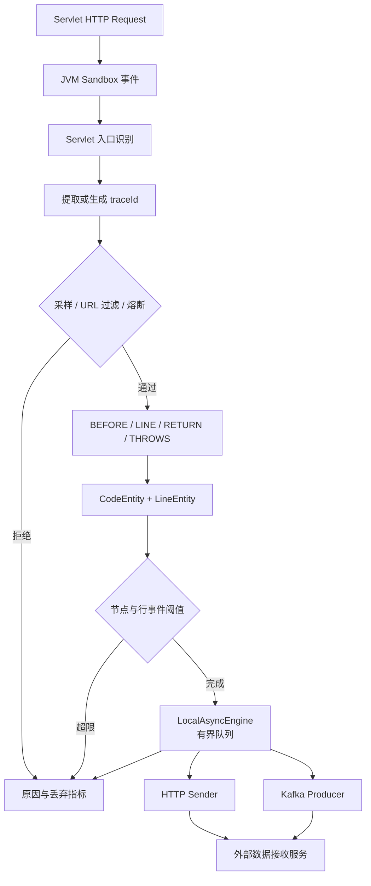

<p align="center"></p>

# DeepCover - JVM 运行时请求与代码关系采集 Agent

**[中文](README.md)** | [English](README_EN.md) | [日本語](README_JA.md) | [Francais](README_FR.md) | [Portugues](README_PT.md) | [Русский](README_RU.md)

> 其他语言版本尚未完全同步本次能力边界与 Benchmark，当前事实以本中文 README 和源码为准。

<div align="center">


</div>

DeepCover 基于 Alibaba JVM Sandbox，在不修改业务源码的情况下，记录一次 Java Servlet HTTP 请求实际执行过的类、方法和代码行，并通过 HTTP 或 Kafka 输出这些运行时关系。

它是精准测试体系中的**运行时证据采集层**，不是完整的覆盖率平台或测试选择平台。

## Why DeepCover

随着服务规模、发布频率和测试资产增长，全量回归通常面临三个问题：

1. 全量执行时间与资源成本持续增长，发布反馈变慢。
2. 仅依赖静态调用分析容易包含理论可达但运行时并未发生的路径。
3. 传统聚合覆盖率能说明“哪些代码被执行”，但通常不能直接回答“哪一个请求或测试执行了这些代码”。

DeepCover 补充的是第三类数据：把请求 traceId、HTTP 上下文与本次执行的类、方法、行号关联起来。上层系统可以将历史运行时关系与代码差异、静态调用图和测试资产结合，用于影响分析、测试选择和覆盖验证。

运行时关系只代表**已经观察到的执行路径**。没有被观察到不等于不可达，因此它不应单独替代静态分析或风险判断。

## 精准测试闭环中的位置

下面是一个完整闭环的目标架构。实线框中的 DeepCover Agent 属于本仓库；标记为“外部”的节点需要由代码平台、测试平台、数据服务或 CI 系统提供。



DeepCover 当前负责：

- 在请求执行期间采集运行时代码关系。
- 生成或复用 traceId，作为外部测试执行与采集数据关联的键。
- 将采集结果投递给外部数据服务。
- 暴露采样、丢弃、队列、发送和熔断指标。

本仓库当前不负责：

- Git Diff 解析、静态调用图构建和变更影响计算。
- 测试用例资产管理、自动选例、测试调度和结果判定。
- 全量/增量覆盖率百分比计算、报告存储和可视化。
- CI 准入规则和发布阻断。
- 基于 AI 的用例生成、风险预测或自主决策。

## 已实现能力

| 能力 | 当前实现 |
|---|---|
| 接入方式 | JVM Sandbox 1.4.0 模块，Java 8 字节码增强，无需修改业务源码 |
| 请求入口 | `javax.servlet.http.HttpServlet.service()` |
| 采集粒度 | 请求上下文、类、方法、方法参数类型、调用序号、执行行号 |
| 采集范围 | `packageName` 正则匹配的类，可配置类、方法、注解和 URL 过滤 |
| TraceId | 优先读取 W3C `traceparent`，其次读取 B3、`X-Trace-Id`、`traceId`；缺失时生成 32 位 ID |
| 采样 | 基于 traceId 哈希的确定性采样，`0-10000` 对应 `0%-100%` |
| 保护机制 | 单请求方法节点上限、单方法行事件上限、有限队列、发送异常熔断 |
| 数据出口 | HTTP 或 Kafka |
| 异步处理 | 请求线程只投递本地有界队列；消费者批量出队。HTTP 模式当前仍按请求逐条发送 |
| 配置 | JVM 系统属性、本地 properties、可选 `deepcover-brain` 配置中心 |
| 运行指标 | 请求原因计数、采集行数、队列状态、发送成功/失败、熔断状态 |
| 生命周期 | 支持模块加载、启动、停止、卸载，以及队列和客户端资源关闭 |

## Agent 架构



一次成功发送的 `CodeEntity` 主要包含：

- HTTP 类型、来源地址、端口、方法、URL 和开始时间。
- 环境、服务名、分支、traceId 和 Sandbox processId。
- `codeInfo`：按执行过程记录的 `LineEntity` 列表。
- 每个 `LineEntity` 的类名、方法名、参数类型、调用序号、开始时间和去重后的行号集合。

## 适用边界

DeepCover 目前最适合测试环境、预发布环境或受控采样的 Java Servlet 服务。使用前需要了解以下边界：

- 当前入口是 Servlet API，不直接覆盖 WebFlux、Netty、Dubbo 或非 HTTP 入口。
- 请求上下文依赖线程本地状态；脱离请求线程执行的异步任务不会自动继承本次关联。
- 代码行采集依赖 class 文件中的行号表；缺少调试行号信息时无法得到完整行级数据。
- trace header 兼容不等于完整分布式追踪实现；本仓库不传播跨服务上下文，也不生成完整 span。
- DeepCover 记录执行事实，不判断业务断言是否正确，也不证明未执行路径不可达。
- 字节码行事件具有可观测开销，生产环境必须先做服务级压测并配置采样率和资源上限。

## 快速开始

### 1. 构建 Agent 与 Demo

```bash
mvn clean package -Dmaven.javadoc.skip=true
mvn -f examples/demo-servlet/pom.xml clean package -Dmaven.javadoc.skip=true
```

构建结果：

- `target/deepcover-agent-1.0-SNAPSHOT-jar-with-dependencies.jar`
- `sandbox/sandbox-module/deepcover-agent-1.0-SNAPSHOT-jar-with-dependencies.jar`
- `examples/demo-servlet/target/demo-servlet.war`
- `examples/demo-servlet/target/demo-servlet-1.0-SNAPSHOT-standalone.jar`

### 2. 启动本地接收端

```bash
python benchmarks/mock_receiver.py --port 18081
```

### 3. 启动带 DeepCover 的 Demo

PowerShell 示例：

```powershell
$agent = "-javaagent:$PWD\sandbox\lib\sandbox-agent.jar=home=$PWD\sandbox;server.ip=127.0.0.1;server.port=4769;namespace=default"

java $agent `
  -Dapp.name=demo-servlet `
  -Denv=test `
  -Ddeepcover.env=test `
  -Ddeepcover.configCenterEnabled=false `
  '-Ddeepcover.packageName=io\.deepcover\.examples\.demo\..*' `
  -Ddeepcover.sampleRate=10000 `
  -Ddeepcover.sendDataCenterType=1 `
  -Ddeepcover.dataCenterAddr=http://127.0.0.1:18081/collect `
  -jar examples/demo-servlet/target/demo-servlet-1.0-SNAPSHOT-standalone.jar
```

### 4. 产生请求并检查结果

```bash
curl "http://127.0.0.1:18080/demo-servlet/user?action=list"
curl "http://127.0.0.1:18080/demo-servlet/user?action=get&id=1"
curl "http://127.0.0.1:4769/sandbox/default/module/http/deepcover/metrics"
curl "http://127.0.0.1:18081/stats"
```

## Test Case 到代码关系 Demo

仓库包含一个最小闭环示例，把外部测试用例 ID 与 DeepCover 的运行时关系连接起来：

```text
Test Case ID -> 确定性 traceId -> HTTP Request -> DeepCover Payload -> Case-to-Code Mapping
```

DeepCover 本身不管理测试用例。示例 runner 保存 `caseId -> traceId`，DeepCover 负责生成 `traceId -> 请求/代码` 证据，两者在接收端结果中关联。

```bash
# 接收端仅在显式开启时保留内存中的采集记录
python benchmarks/mock_receiver.py --port 18081 --capture-records

# Demo 与 Agent 启动后执行三个示例用例
python examples/test-case-mapping/run_mapping.py
```

输出包含测试用例、请求路径、traceId，以及实际观察到的类、方法和行号。完整步骤和边界见 [Test Case Mapping Demo](examples/test-case-mapping/README.md)。

## 配置

独立运行最直接的方式是使用 JVM 系统属性。`deepcover.properties` 主要用于按环境配置数据中心、配置中心和 Kafka 地址；配置中心可以通过 `deepcover.configCenterEnabled=false` 关闭。

| JVM 属性 | 默认值 | 说明 |
|---|---:|---|
| `app.name` | `unknown` | 服务名，必填 |
| `env` / `deepcover.env` | `unknown` | 采集环境，必填 |
| `branch` | `master` | 代码分支标识 |
| `deepcover.packageName` | 空 | 需要增强的业务类正则，必填 |
| `deepcover.sampleRate` | `10000` | `10000=100%`、`1000=10%`、`100=1%` |
| `deepcover.ignoreClasses` | 空 | 忽略类正则，分号分隔 |
| `deepcover.ignoreMethods` | 空 | 忽略方法模式，分号分隔 |
| `deepcover.ignoreAnnos` | 空 | 忽略注解，分号分隔 |
| `deepcover.ignoreUrls` | 空 | 忽略 URL 正则，分号分隔 |
| `deepcover.limitCodeMethodSize` | `500` | 单请求最大方法节点数；超限后整次请求不发送 |
| `deepcover.limitCodeMethodLineSize` | `500` | 单方法最大行事件数；超限后停止该方法的行采集 |
| `deepcover.sendDataCenterType` | `1` | `1=HTTP`，`2=Kafka` |
| `deepcover.dataCenterAddr` | 空 | HTTP 接收地址 |
| `deepcover.kafkaBootstrapServers` | 空 | Kafka broker 列表 |
| `deepcover.kafkaTopic` | 空 | Kafka topic |
| `deepcover.queueNum` | `1` | 本地队列和消费线程数量 |
| `deepcover.queueSize` | `100` | 每个队列容量 |
| `deepcover.queueMsgSize` | `50` | 每次出队的最大消息数 |
| `deepcover.queueRecycleTime` | `10` | 空队列轮询休眠时间，毫秒 |
| `deepcover.exceptionThreshold` | `10` | 时间窗口内触发熔断的发送异常数 |
| `deepcover.exceptionCalcTime` | `1` | 异常统计窗口，分钟 |
| `deepcover.exceptionPauseTime` | `5` | 熔断暂停时间，秒 |

`syncConfig` 只会立即应用不需要重建监听器或队列的配置。响应中的 `restartRequired` 会列出已收到但未生效的结构性配置。

立即生效：`sampleRate`、异常阈值、采集阈值、`queueMsgSize`、`queueRecycleTime`、`ignoreUrls`、发送类型和配置版本。

需要重启并通过启动配置提供：`packageName`、`ignoreClasses`、`ignoreMethods`、`ignoreAnnos`、`queueNum`、`queueSize`、`reportPeriod`。

完整说明见 [配置指南](docs/configuration-guide.md)。

## 运行控制与指标

```bash
# 重新注册采集监听器
curl -X POST "http://127.0.0.1:4769/sandbox/default/module/http/deepcover/startCodeModule"

# 同步可动态生效的配置
curl -X POST "http://127.0.0.1:4769/sandbox/default/module/http/deepcover/syncConfig" \
  -d "sampleRate=1000&exceptionThreshold=20"

# 查看指标
curl "http://127.0.0.1:4769/sandbox/default/module/http/deepcover/metrics"

# 卸载模块
curl -X POST "http://127.0.0.1:4769/sandbox/default/module/http/deepcover/unloadCodeModule" \
  -d "serviceName=demo-servlet"
```

指标包括：

- `totalRequests`、`collectedRequests`、`sampledOutRequests`、`ignoredRequests`。
- `emptyRequests`、`thresholdDroppedRequests`、`droppedRequests`。
- `totalLinesCollected`、`methodThresholdReached`。
- `sendSuccess`、`sendFailed`、`queueOfferFailed`。
- `queueDepth`、`queueCapacity`、`queueCount`、`queueRunning`。
- `circuitBreakerTripped`、`circuitBreakerDroppedRequests`、`circuitBreakerPaused`。

## Benchmark

仓库提供固定目标 RPS 的基准工具，并在写入结果前校验队列排空、发送结果和接收端计数。

2026-09-20 的优化后实验聚焦 100 和 200 RPS，每组运行 3 次，并轮换场景顺序。以下是中位数；Baseline 未加载 Sandbox，采样场景包含 Sandbox 与 DeepCover 的整体成本。

| 目标负载 | 场景 | 实际 RPS | P99 ms | 平均 CPU % | 平均 RSS MB |
|---:|---|---:|---:|---:|---:|
| 100 | Baseline | 99.8 | 35.0 | 52.0 | 108.6 |
| 100 | 10% 采样 | 99.8 | 122.4 | 250.4 | 222.4 |
| 100 | 100% 采样 | 99.8 | 36.6 | 283.0 | 233.4 |
| 200 | Baseline | 199.4 | 38.4 | 96.9 | 132.9 |
| 200 | 10% 采样 | 199.4 | 849.0 | 316.2 | 215.6 |
| 200 | 100% 采样 | 188.0 | 1048.5 | 330.4 | 221.1 |

在 200 RPS 下，按同一 repeat 的 Baseline 配对计算，10% 与 100% 采样的吞吐变化中位数分别为 `-0.1%` 和 `-4.3%`。但 CPU 仍增加 `184.3` 和 `233.4` 个百分点，RSS 增加 `82.7 MB` 和 `92.5 MB`，P99 仍处于 `849.0-1048.5 ms`，因此尾延迟与资源成本仍是明确瓶颈。

### Performance Optimization Journey

1. **Profile**：Oracle JDK 8 JFR 显示，请求入口动态代理与反射方法解析是首轮主要分配热点；`Method.copy` 有 987 个顶层分配样本，代理调用和方法查找分别出现在 1070、1057 个包含式分配样本中。
2. **Optimize**：按请求类缓存 Servlet 访问方法，移除入口动态代理；trace header 命中后短路；避免 `traceparent` 正则切分和未使用的请求字段读取；去掉 `LineEntity` JSON 往返转换、集合临时字符串、同步 `Stack` 和关闭级别日志的提前序列化。
3. **Verify**：优化后的 JFR 主要热点列表中不再出现上述代理/反射帧。200 RPS 的配对吞吐损失从首轮的 `-8.7% / -17.9%` 变为 `-0.1% / -4.3%`（10% / 100% 采样）。
4. **Remaining bottleneck**：HTTP 逐条同步发送和 JSON 序列化成为主要 Agent CPU 路径；LINE 事件、ThreadLocal 状态、增强范围和队列竞争仍需结合真实服务继续评估。

前后两组 Benchmark 是同机顺序执行，并非交错 A/B；Baseline 和 P99 存在波动，不能把全部变化严格归因于本次代码优化。完整方法、配对数据、JFR 证据和限制见 [Benchmark 结果](benchmarks/RESULTS.md)。

## 构建与测试

```bash
mvn clean test -Dmaven.javadoc.skip=true
mvn clean package -Dmaven.javadoc.skip=true
```

当前根工程包含 69 个单元测试，最近一次验证结果为 69 passed、0 failed、0 errors、0 skipped。

## 兼容性与部署注意事项

- Java 8+，构建目标为 Java 8。
- JVM Sandbox 版本为 1.4.0。
- 项目已有部署经验要求 DeepCover/Sandbox javaagent 位于 SkyWalking javaagent 之前；仍应在目标应用和目标 agent 版本上验证。
- 建议先在测试或预发布环境校准采样率、包范围、队列容量和熔断阈值。
- HTTP 和 Kafka 接收端应具备幂等、容量保护和数据保留策略，这些能力不由本仓库提供。

## 文档

- [配置指南](docs/configuration-guide.md)
- [部署指南](docs/deployment-guide.md)
- [Demo](examples/demo-servlet/README.md)
- [Test Case Mapping Demo](examples/test-case-mapping/README.md)
- [Benchmark 结果](benchmarks/RESULTS.md)
- [贡献指南](CONTRIBUTING.md)
- [变更记录](CHANGELOG.md)
- [许可证](LICENSE)

## License

DeepCover 使用 [Apache License 2.0](LICENSE)。
